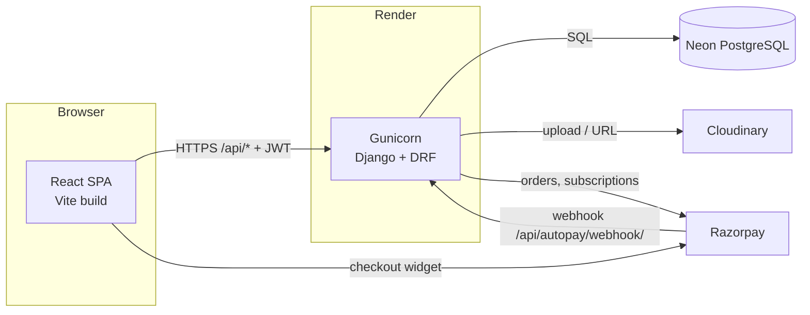

# 1. Overview

## What Athirai does

| Area | Summary |
|---|---|
| **Distribution network** | Super Admin supplies coins and jewellery. Stock moves down the hierarchy through **requests** that each leader approves. Leaders who lack stock can **forward** a request to their own leader. |
| **Store sales** | Super Stockists, Distributors, Wholesale Dealers, Retailers and Shops sell stock they hold to walk-in customers and print a branded PDF receipt. |
| **E-commerce** | Customers (and network members) browse collections, add to cart/wishlist, pay by Razorpay or AUG coins, and track orders. |
| **Commission** | Every successful order pays a 27% pool up the buyer's creator chain as AUG coins. |
| **Growth** | Customers can refer customers. Members who hit sales and team-size targets are promoted to the next tier. |
| **Engagement** | Daily login rewards, announcements, notify-me for sold-out products, autopay recharge. |

## Tech stack

| Layer | Technology |
|---|---|
| Backend | Python 3.12, Django 4.2.11, Django REST Framework 3.14, SimpleJWT 5.3 |
| Database | PostgreSQL (Neon, pooled connection) via `dj-database-url`, `psycopg2-binary` |
| Files | Cloudinary (`django-cloudinary-storage`) for product images and banners |
| Payments | Razorpay (one-time orders, coin recharge, subscription autopay + webhook) |
| PDFs | ReportLab (order receipts, sale receipts, generic table export) |
| Serving | Gunicorn + WhiteNoise on Render |
| Frontend | React 19, Vite (rolldown), React Router 7, Axios |
| Charts / export | Recharts, ExcelJS, SheetJS (`xlsx`), Framer Motion |

## System diagram



The frontend reads its API base from `VITE_BASE_URL`; when unset it falls back to the production Render URL (`frontend/src/api.js`). A local frontend without `frontend/.env` therefore talks to **production**.

## Repository layout

```
BitByte-Marketing/
├── backend/
│   ├── manage.py
│   ├── requirements.txt
│   ├── .env                      # live secrets — never commit
│   ├── bitbyte_backend/          # Django project: settings.py, urls.py, wsgi.py
│   └── accounts/                 # the single Django app — all business logic
│       ├── models.py             # 34 models
│       ├── serializers.py
│       ├── views.py              # ~11,400 lines, ~117 API views
│       ├── urls.py               # 123 routes under /api/
│       ├── migrations/           # 0001 … 0067
│       └── management/commands/  # dummy-data seeders, create_default_user
├── frontend/
│   ├── package.json
│   └── src/
│       ├── main.jsx, App.jsx     # router, route guards, navbar wrappers
│       ├── api.js                # Axios instance, JWT refresh, PDF helpers
│       ├── pages/                # role dashboards, login, register, profile
│       ├── Coins_products/       # coin & jewellery stock, requests, transactions, sales
│       ├── Hierarchy/, Grid/     # network tree and grid views per role
│       ├── Superadmin/           # manage users, shop list
│       ├── Create_Users/         # create Super Stockist / Distributor / … forms
│       ├── Orders/               # sales report, login active/inactive, order pages
│       ├── Promotions/           # tier promotion approval pages
│       ├── payments/             # commission, revenue, wallet, send coins
│       ├── LoginRewardManagement/
│       ├── Products/             # add product, banners, stock notifications
│       ├── collection/           # storefront + all navbars
│       ├── gold_silver/, Diamond/, Platinum/   # category listing pages
│       └── components/           # SvgIcons, Skeleton, shared bits
└── docs/                         # this documentation
```

## Glossary

| Term in UI | Code / database value | Meaning |
|---|---|---|
| Super Admin | `super_admin` | Company owner. Holds the vault stock. Exactly one account. |
| Super Stockist | `admin` | Tier 1 partner (`AdminProfile`) |
| Distributor | `dealer` | Tier 2 (`DealerProfile`) |
| Wholesale Dealer | `sub_dealer` | Tier 3 (`SubDealerProfile`) |
| Retailer | `promotor` | Tier 4 (`PromotorProfile`) |
| Customer | `customer` | End buyer (`CustomerProfile`) |
| Shop | `shop` | Physical or virtual store in a separate shop network (`ShopProfile`) |
| AUG coins | `Wallet.balance_coins` | In-app currency. 100 coins = ₹1. |
| Vault / My Vault Stock | `CoinStock`, `JewelryStock` | Physical coins or jewellery a user holds |
| Request | `CoinRequest`, `JewelryRequest` | Ask your leader for stock |
| Forward | `forwarded_for` link | A leader passes the missing quantity to their own leader |
| Master mint | `reject_reason='MASTER_MINT'` | Super Admin adding stock to the vault; logged as a request row |
| Stock sale | `StockSale` | A member selling held stock to a walk-in customer |

The role codes are historical (`admin`, `dealer`, `sub_dealer`, `promotor`). The UI labels in the table are what users see; always use the **code values** in backend logic.
