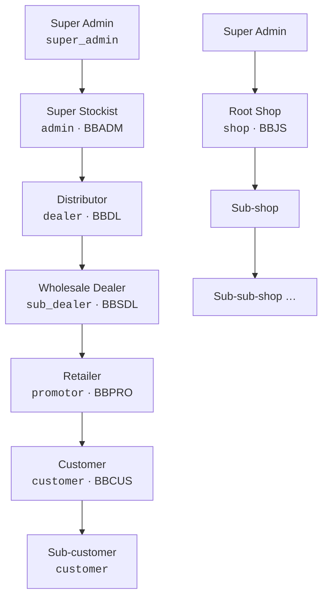

# 2. Roles & hierarchy

## The two networks

### Main network

Each profile points to its parent through an `assigned_*` foreign key and records who created it in `created_by`.

| Role (UI) | Code | Profile model | Parent link | ID format | Created by |
|---|---|---|---|---|---|
| Super Admin | `super_admin` | — (just `User`) | — | — | Django superuser command |
| Super Stockist | `admin` | `AdminProfile` | Super Admin (implicit) | `BBADM{year}{1001+}` | Super Admin (`POST /api/admins/`) |
| Distributor | `dealer` | `DealerProfile` | `assigned_admin` | `BBDL{year}{0000001}` | Super Stockist (`POST /api/dealers/`) |
| Wholesale Dealer | `sub_dealer` | `SubDealerProfile` | `assigned_dealer` | `BBSDL{year}{0000001}` | Distributor (`POST /api/sub-dealers/`) |
| Retailer | `promotor` | `PromotorProfile` | `assigned_sub_dealer` | `BBPRO{year}{0000001}` | Wholesale Dealer (`POST /api/promotors/`) |
| Customer | `customer` | `CustomerProfile` | `assigned_promotor` (or a referring customer) | `BBCUS{year}{0000001}` | Retailer, Customer, Super Admin, or self-registration via referral link / OTP |

Two different "parent" notions exist and they are used for different things:

| Link | Used for |
|---|---|
| `assigned_*` (e.g. `DealerProfile.assigned_admin`) | Stock request routing, team scoping, hierarchy tree/grid |
| `created_by` | **Commission chain** (see [Business flows §7](07-business-flows.md#7-commission)) and promotion eligibility |

Normally they agree. They can differ if a user was created by someone other than their assigned parent, so check which one a feature needs.

### Shop network

| Field | Meaning |
|---|---|
| `ShopProfile.created_by` | The parent. If it is another shop, this is a **sub-shop**; if it is Super Admin (or null, for self-registration) it is a **root shop**. |
| `shop_type` | `live` (physical) or `virtual` |
| `shop_id` | `BBJS{year}{00001}` |

A shop's coin and jewellery requests go to its parent shop, or to Super Admin for a root shop (`_shop_parent_user` in `views.py`). A shop sees its whole subtree (`_shop_network_user_ids`). Shops can be registered publicly: `POST /api/shops/` allows anonymous callers.

## Team scope — who can see what

Almost every list endpoint in the stock, request, holdings and sales areas is **team-scoped** through `_team_user_ids(user)`:

| Viewer | Sees |
|---|---|
| Super Admin | Everything (`None` = no filter) |
| Super Stockist | Self + Distributors, Wholesale Dealers and Retailers under them |
| Distributor | Self + Wholesale Dealers and Retailers under them |
| Wholesale Dealer | Self + Retailers under them |
| Retailer | Self only |
| Shop | Self + every shop in its subtree |

Customers are deliberately excluded from stock teams because they cannot hold stock. Rule of thumb: a user may see records where they, or anyone below them, are the requester, approver or seller. Siblings and other branches are never visible.

## What each role can do

✅ = allowed · — = not available

| Capability | Super Admin | Super Stockist | Distributor | Wholesale | Retailer | Shop | Customer |
|---|---|---|---|---|---|---|---|
| Create the next tier down | Super Stockist | Distributor | Wholesale | Retailer | Customer | Sub-shop (via registration link) | Sub-customer |
| Add coins / jewellery to vault directly | ✅ (master mint) | — | — | — | — | — | — |
| Request coins / jewellery from leader | — | ✅ | ✅ | ✅ | ✅ | ✅ | — |
| Approve / decline requests from team | ✅ (any request; password required) | ✅ | ✅ | ✅ | — | ✅ | — |
| Forward a request up the chain | — | ✅ | ✅ | ✅ | — | ✅ | — |
| Sell held stock to walk-in customer | — | ✅ | ✅ | ✅ | ✅ | ✅ | — |
| See team holdings | ✅ all | ✅ team | ✅ team | ✅ team | own | ✅ subtree | — |
| Shop on storefront (cart, orders) | — | ✅ | ✅ | ✅ | ✅ | — | ✅ |
| Earn commission | ✅ (1% + balance) | ✅ | ✅ | ✅ | ✅ | — | ✅ (as referrer) |
| Daily login rewards | — | ✅ | ✅ | ✅ | ✅ | ✅ | ✅ |
| Manage products, banners, metal rates | ✅ | — | — | — | — | — | — |
| Approve tier promotions | ✅ | — | — | — | — | — | — |
| Send AUG coins manually | ✅ | — | — | — | — | — | — |

Super Admin approvals and declines on the request pages require re-entering the Super Admin password (`password` in the request body).

## Pages per role

Routing lives in `frontend/src/App.jsx`. `ProtectedRoute` checks `localStorage.role`; a wrong role clears storage and redirects to `/login`. `/dashboard` redirects each role to its home page.

### Home and network pages

| Role | Home | Hierarchy tree | Hierarchy grid |
|---|---|---|---|
| Super Admin | `/super-admin` | `/superadmin-hierarchy` | `/superadmin-hierarchy-grid` |
| Super Stockist | `/admin` | `/admin-hierarchy` | `/admin-hierarchy-grid` |
| Distributor | `/dealer` | `/dealer-hierarchy` | `/dealer-hierarchy-grid` |
| Wholesale Dealer | `/sub-dealer` | `/subdealer-hierarchy` | `/subdealer-hierarchy-grid` |
| Retailer | `/promotor` | `/promotor-hierarchy` | `/promotor-hierarchy-grid` |
| Shop | `/shop-dashboard` | `/shop-hierarchy-tree` | `/shop-hierarchy-grid` |
| Customer | `/customer` (same as `/`) | — | — |

### Coins & jewellery (all stock roles: `super_admin`, `admin`, `dealer`, `sub_dealer`, `promotor`, `shop`)

| Page | Route | Component |
|---|---|---|
| Add / Buy coins | `/buy-coin` | `Coins_products/Buy_Coin.jsx` |
| Available coins (vault + team holdings + Sell) | `/available-coins` (alias `/stored-coins`) | `Stored_coins.jsx` |
| Coin requests | `/coin-requests-page` | `Coin_Requests.jsx` |
| Coin transactions | `/coin-transactions` | `Transaction_History.jsx` |
| Coin sales | `/coin-sales` | `Stock_Sales.jsx` (`kind="coin"`) |
| Add / Buy jewellery | `/add-jewellery`, `/buy-jewellery` | `Add_Jewellery.jsx` |
| Available jewellery | `/available-jewellery` | `Available_Jewellery.jsx` |
| Jewellery requests | `/jewellery-requests` | `Jewellery_Requests.jsx` |
| Jewellery transactions | `/jewellery-transactions` | `Jewellery_Transactions.jsx` |
| Jewellery sales | `/jewellery-sales` | `Stock_Sales.jsx` (`kind="jewellery"`) |
| Member holdings detail | `/member-holdings/:userId` | `MemberHoldingsDetail` |
| Coin rewards | `/coins-reward` | `CoinsReward` |

### Managing people

| Page | Route | Allowed roles |
|---|---|---|
| Create Super Stockist | `/create-super-stockist` | super_admin |
| Create Distributor | `/create-distributor` | admin |
| Create Wholesale Dealer | `/create-wholesale-dealer` | dealer |
| Create Retailer | `/create-retailer` | sub_dealer |
| Create Customer | `/create-customer` | customer, promotor, sub_dealer, dealer, admin, super_admin |
| Manage Super Stockists | `/superadmin/manage-users/super-stockist` | super_admin |
| Manage Distributors | `/superadmin/manage-users/distributor` | super_admin, admin |
| Manage Wholesale Dealers | `/superadmin/manage-users/wholesale-dealer` | super_admin, admin, dealer |
| Manage Retailers | `/superadmin/manage-users/retailer` | super_admin, admin, dealer, sub_dealer |
| Manage Customers | `/superadmin/manage-users/customer` | super_admin, admin, dealer, sub_dealer, promotor |
| Shop list | `/superadmin/manage-users/shops` | shop, super_admin |
| General / referral customers | `/general-customers`, `/referral-customers` | super_admin |

### Reports, money and rewards

| Page | Route | Allowed roles |
|---|---|---|
| Sales report | `/sales-report` | any logged-in |
| Hierarchy sales count | `/hierarchy-sales-count` | super_admin, admin, dealer, sub_dealer, promotor |
| Login active / inactive | `/login-active`, `/login-inactive` | any (page checks role itself) |
| Shop report | `/shop-report` | shop, super_admin |
| My / team commission | `/internal-my-commission`, `/internal-team-commission` | admin, dealer, sub_dealer, promotor |
| My / team login rewards | `/internal-my-login-rewards`, `/internal-team-login-rewards` | admin, dealer, sub_dealer, promotor |
| Payments, revenue, commissions | `/superadmin-payments`, `/athirai-revenue`, `/general-customer-revenue`, `/superadmin-commission`, `/my-commission`, `/commissions` | super_admin |
| Send AUG coins, autopay list | `/superadmin-send-coins`, `/superadmin-autopay-list` | super_admin |
| Login reward transactions | `/login-reward-transactions` | super_admin |
| Promotions (4 tiers + sales order list) | `/promotions/*` | super_admin |

### Catalogue management (Super Admin)

`/add-product`, `/add-new-product`, `/sold-out-products`, `/stock-notifications`, `/add-banners`, `/home-banner`, `/admin-orders`.

### Storefront (public or customer)

`/`, `/collection/*`, `/gold-*`, `/silver-*`, `/diamond-*`, `/platinum-*`, `/product-display`, `/aug-products`, `/order-confirm`, `/order-payment`, `/nearby-shop`, `/bj-live`, `/profile`. Cart, wishlist, order summary and recharge (`/cart`, `/wishlist`, `/order-summary`, `/recharge`) need a customer or network role.

## Navbars

| Wrapper (App.jsx) | Shows |
|---|---|
| `WithSuperAdminNavbar` | Super Admin navbar (`collection/SuperAdminNavbar.jsx`), including voice search |
| `WithInternalRoleNavbar` | Super Admin navbar for `super_admin`, `ShopNavbar` for `shop`, otherwise `InternalRoleNavbar` configured per role |
| `WithCustomerNavbar` | Storefront navbar |
| `WithAnyNavbar` | Customer navbar for customers, internal navbar for everyone else |
