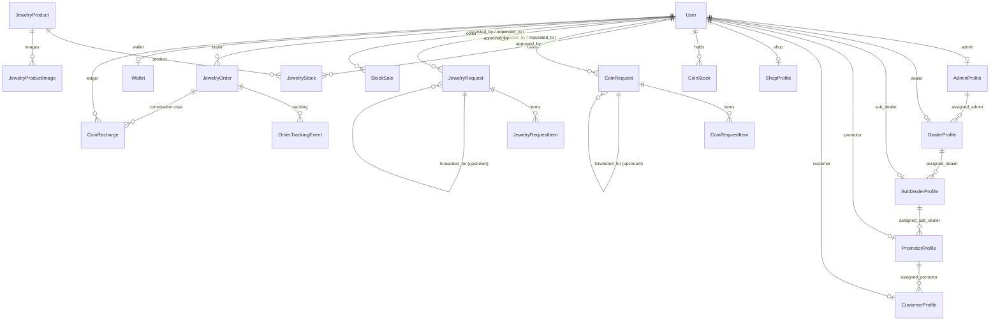

# 5. Data model

All models live in `backend/accounts/models.py`. Primary keys are `BigAutoField`.

## Entity overview

## People

| Model | Key fields | Notes |
|---|---|---|
| `User` | `email` (login, unique), `role`, `is_active`, `is_staff`, `created_at`, `last_login` (indexed) | Custom user, `USERNAME_FIELD='email'`. Login also accepts phone or member ID (`find_user_by_login_identifier`). |
| `AdminProfile` | names, `mobile_number`, address, `aadhaar_no`, `pan_no`, occupation, `admin_id` | Super Stockist. `admin_id = BBADM{year}{1000+n}` |
| `DealerProfile` | same personal fields, `assigned_admin`, `dealer_id` | Distributor. `BBDL{year}{n:07}` |
| `SubDealerProfile` | …, `assigned_dealer`, `sub_dealer_id` | Wholesale Dealer. `BBSDL{year}{n:07}` |
| `PromotorProfile` | …, `assigned_sub_dealer`, `promotor_id` | Retailer. `BBPRO{year}{n:07}` |
| `CustomerProfile` | …, `assigned_promotor`, `customer_id`, `retailer_status` | `BBCUS{year}{n:07}`. `retailer_status` tracks promotion to Retailer. |
| `ShopProfile` | `shop_name`, `owner_name`, `mobile_number`, address, `shop_type` (`live`/`virtual`), `pan_no`, `gst_no`, `msme_no`, `shop_id` | `BBJS{year}{n:05}`. Parent = `created_by`. |
| `ProfileUpdateRequest` | proposed field values, `proof_document`, `status` | Member asks for profile change; approver applies it |

Every profile has `created_by → User` (`SET_NULL`). Profile promotion fields (`retailer_status`, `wholesale_status`, `distributor_status`, `super_stockist_status`) hold `none / pending / approved / rejected`.

> ID generation uses `Model.objects.count() + 1`. Deleting rows or creating two users at once can produce a duplicate. Shops and products retry in a loop; the other profiles do not.

## Catalogue & storefront

| Model | Key fields | Notes |
|---|---|---|
| `MetalRate` | `date` (unique), `gold_22k`, `gold_24k`, `silver_999`, `diamond_18k`, `diamond_22k`, `platinum_92` | ₹ per gram. `GET /api/metal-rates/` returns today's row, else the latest. |
| `JewelryProduct` | `category`, `metal`, `grade`, `name`, `cross_weight`, `stone_weight`, `net_weight`, `making_charge` (%), `wastage_charge` (%), `die_charge` (₹ flat), `stone_value` (₹), `tax_percent` (3), `price`, `original_price`, `tag`, `occasion`, `gender`, `gift_tags`, `age_group`, `is_active`, `product_code`, `stock_quantity`, `low_stock_threshold`, `is_internal_asset` | `product_code = JWL{year}{n:05}`. `is_internal_asset=True` = created through Add Jewellery (vault stock, not a storefront listing). |
| `JewelryProductImage` | `product`, `image`, `order` | Cloudinary |
| `HomeBanner` | `slot` 1–5 (unique), `image`, `is_active` | |
| `CartItem`, `Wishlist` | `user`, `product` (+`qty`) | Unique per user and product |
| `StockNotifyRequest` | `user`, `product`, `notified` | "Notify me" on sold-out items |
| `JewelryOrder` | product snapshot, customer and address, `quantity`, `unit_price`, `total_price`, `payment_method`, `payment_status`, Razorpay ids, `status`, `order_id` | `BBORD{year}{n:06}`. Status: pending → confirmed → processing → shipped → delivered / cancelled. |
| `OrderTrackingEvent` | `order`, `stage`, `location`, `note` | Timeline: confirmed, processing, packed, shipped, in_transit, out_for_delivery, delivered, cancelled |
| `MetalOrder` | metal, weight, count, rate, totals, `status` | Legacy bullion order |

## Stock network

| Model | Key fields | Notes |
|---|---|---|
| `CoinStock` | `user`, `metal_type` (`gold_22k` / `gold_24k` / `silver_999`), `weight_label` ("500 mg", "1 gm"), `weight_grams`, `qty` | Unique per (user, metal, weight). Super Admin's first visit to Available Coins seeds a default vault (`INITIAL_COINS` in `CoinStockView`). |
| `JewelryStock` | `user`, `product`, `qty` | Unique per (user, product). For Super Admin, internal products' `stock_quantity` also counts as vault stock. |
| `CoinRequest` / `JewelryRequest` | `requested_by`, `requested_to`, `approved_by`, `status` (`pending` / `sent` = approved / `rejected`), `reject_reason`, `created_at`, `sent_at`, `forwarded_for` | `reject_reason='MASTER_MINT'` marks a Super Admin vault addition. `forwarded_for` links an upstream (forwarded) request to the request it was created for. |
| `CoinRequestItem` | `request`, `metal_type`, `weight_label`, `weight_grams`, `qty` | |
| `JewelryRequestItem` | `request`, `product`, `qty` | |
| `StockSale` | `kind` (`jewellery` / `coin`), `seller`, `customer_name`, `customer_phone`, product snapshot, `metal`, `grade`, `gross_weight`, `net_weight`, `qty`, `rate_per_gram`, `making_percent`, `stone_value`, `die_charge`, `gst_percent`, `mrp_amount`, `discount_percent`, `discount_amount`, `final_amount`, `status` (`completed` / `cancelled`), `cancelled_at`, `created_at` | Receipt number shown as `BBSALE{id:06}` |

## Money & engagement

| Model | Key fields | Notes |
|---|---|---|
| `Wallet` | `balance_coins`, `lifetime_spent`, `lifetime_coins_purchased`, `lifetime_recharge_count` | One per user. 100 coins = ₹1 (`COIN_RATE_PER_RUPEE`). |
| `CoinRecharge` | `amount_paid`, `coins_credited`, `payment_method`, `status`, `entry_type` (credit/debit), `source` (recharge / commission / purchase / admin_credit / reward), `related_order`, `commission_level`, `transaction_id` | **Unified ledger** for every wallet movement. `commission_level`: 1..n = chain level, 0 = Super Admin balance, -1 = Super Admin fixed 1%. |
| `AutoPayMandate` | `amount`, `frequency`, `recharge_day`, Razorpay plan/subscription ids, `status`, `is_active`, `next_charge_date`, last-charge fields | Razorpay subscription for recurring recharge |
| `DailyLoginLog` | `user`, `login_date` | One row per user per day; streak source |
| `CoinRewardLog` | `user`, `reward_type`, `coins`, `date` | first_login, daily_login, bonus_10/20/30 |
| `ReferralLink` | `token`, `referrer`, `used`, `used_by`, `used_at` | One-time registration link |
| `EmailOTP` | `email`, `otp`, `purpose`, `is_verified` | Valid for 10 minutes |
| `Announcement` / `AnnouncementReply` | `title`, `message`, `target_roles` (JSON), `target_user`; one reply per user | Broadcast or personal messages |

## Delete behaviour

⚠️ This is the most important section on this page.

Most foreign keys to `User` are `on_delete=CASCADE`. **Deleting a user deletes, without warning:**

| Deleted with the user | Because of |
|---|---|
| Every coin or jewellery request they sent **or received** | `requested_by`, `requested_to` = CASCADE |
| Their coin and jewellery stock | `CoinStock.user`, `JewelryStock.user` = CASCADE |
| Their store sales | `StockSale.seller` = CASCADE |
| Their orders, wallet, ledger, rewards, cart, wishlist | CASCADE |
| Their profile | `OneToOne` CASCADE |

Kept (set to NULL): `approved_by` on requests, every `created_by`, `JewelryProduct.created_by`, `MetalRate.created_by`.

Deleting **Super Admin** therefore wipes every request that was ever sent to Super Admin and the whole vault. This happened in production on 30 Sep 2026; see [Operations → incidents](08-operations-and-safety.md#incident-log). **Never delete users with history.** Deactivate them instead (`is_active=False`). A planned hardening is to switch these keys to `PROTECT`.

## Migrations

69 migrations (`0001` … `0067`). Recent ones:

| Migration | Change |
|---|---|
| `0064_jewelryorder_product_net_weight` | Weight snapshot on orders (+ backfill) |
| `0065_jewelryrequest_forwarded_for` | Jewellery forward chain |
| `0066_stocksale` | Store sales |
| `0067_coinrequest_forwarded_for` | Coin forward chain |
