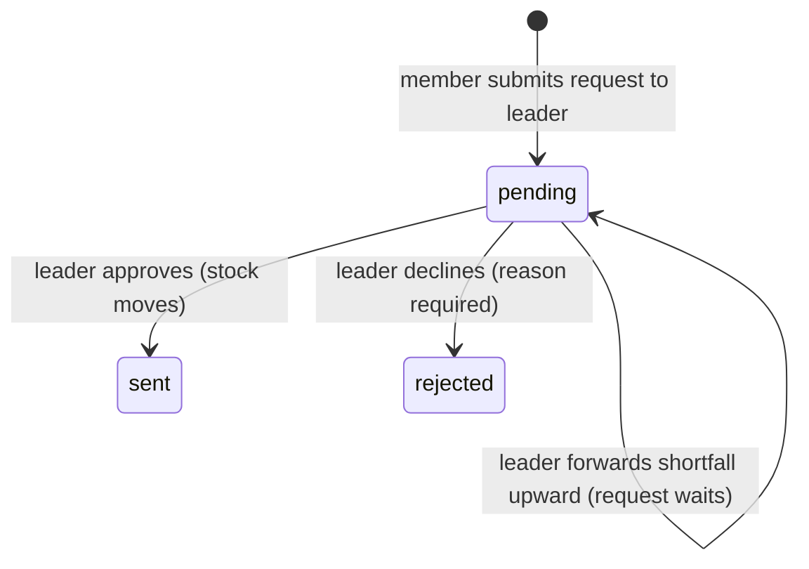
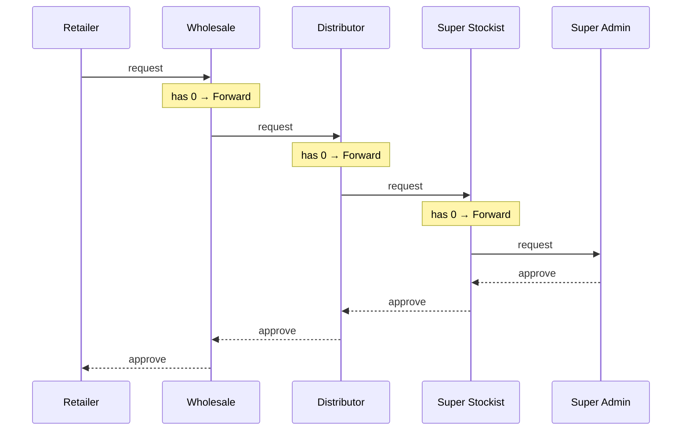
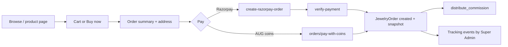

# 7. Business flows

## 1. Stock requests (coins and jewellery)

Stock only moves **down** the network, and only when the holder approves a request.

| Step | What happens | Code |
|---|---|---|
| Request | `POST coin-requests/` or `jewelry-requests/` creates a `pending` request addressed to the caller's direct leader: Retailer → Wholesale → Distributor → Super Stockist → Super Admin. A shop sends it to its parent shop, or to Super Admin for a root shop. | `CoinRequestView.post`, `JewelryRequestView.post`, `_jewelry_request_target` |
| Approve | Inside one DB transaction with `select_for_update`: check the approver's stock for every item, deduct it, add it to the requester, set `status='sent'`, `sent_at`, `approved_by`. | `CoinRequestApproveView`, `JewelryRequestApproveView` |
| Decline | `status='rejected'`, `reject_reason=<message>` | `…RejectView` |
| Approve all | Approves every pending request to the caller in one go. Checks total stock needed first. Skips requests waiting on a forward. | `CoinRequestApproveAllView` |

**Super Admin approvals.** Super Admin can approve or decline **any** pending request after re-entering their password. For a request addressed to someone else, stock is taken from that assigned leader if they hold enough; otherwise from the Super Admin vault. The exception is forward-chain requests (next section): Super Admin may not skip a level on those.

**Master mint.** Super Admin adds coins with `POST coin-stock/add/`, or jewellery by creating an internal product in Add Jewellery. Each addition is also stored as a request row with `requested_by = requested_to = Super Admin`, `status='sent'` and `reject_reason='MASTER_MINT'`, so it appears in transaction history.

## 2. Forward chain

Used when a leader lacks what their downline asked for. The same rules apply to coins and jewellery.

**Rules**

1. Only the receiver of a pending request can forward it, and Super Admin cannot forward.
2. Only the **shortfall** is forwarded: needed minus what the forwarding leader already holds. Items they already hold stay with them. On the upper card this shows as green text, e.g. "Silver 999 50 gm × 5 is already with <leader>" (`covered_by_forwarder`).
3. While an upstream request is `pending`, the original request cannot be approved or declined.
4. **Every leader approves manually.** Stock moves one level per approval and never skips a level. Super Admin approving a lower chain request directly, or through approve-all, is refused.
5. If the upper leader declines, the lower leader sees "Leader declined: <reason>" and can **Forward again** or decline their own request.

**Data.** `forwarded_for` links each upstream request to the one below. The serializer walks the links to build `chain`: every hop with from/to, role and status, used by the stepper UI (→ request going up, ← stock coming back, ✕ declined). The transactions board has a separate **Forward Chains** card (`card=chain`).

**Buy pages.**
- `jewelry-requests/catalog/` splits designs into "with your leader" and "Super Admin products".
- `coin-requests/catalog/` returns `leader_stock` and `super_admin_stock` keyed by `metal_type|weight_label`. Buy Coin shows each weight as "N ready", "Via forward" or "On request".

## 3. Store sales & receipts

Stock holders (not Super Admin, not customers) sell to walk-in customers from **Available Coins / Available Jewellery → My Vault Stock → Sell**.

| Step | Detail |
|---|---|
| Validate | Customer name, 10-digit phone, `qty ≥ 1`, stock available (row locked with `select_for_update`) |
| Price | Computed **on the server**; the frontend number is only a preview |
| Save | `StockSale` with a full price and product snapshot, stock reduced in the same transaction |
| Receipt | `GET stock-sales/<id>/receipt/`: Athirai-design PDF with base metal, making, stone, die, making discount, GST, total. Cancelled sales print a red note. |
| Cancel | Seller only, **same calendar day**. Stock is returned, `status='cancelled'`. |
| Visibility | Seller + everyone above them + Super Admin. Other branches get 403 on the receipt. |

### Pricing

| Item | Formula |
|---|---|
| Jewellery MRP | `(net_wt × rate × (1 + making%/100) + stone + die) × 1.03` |
| Jewellery sold price | `(net_wt × rate × (1 + (making% − discount%)/100) + stone + die) × 1.03` |
| Discount limit | `0 ≤ discount% ≤ making% / 2`. Discount comes **only out of the making charge**; metal value is never discounted. |
| Coin price | `grams × rate × 1.03`. No making, so no discount. |
| Rounding | Nearest rupee, half-up (`ROUND_HALF_UP`), matching `Math.round` in the UI |
| Rate | Latest `MetalRate` row: 22K / 24K by grade, `silver_999` for silver |

If a product has no weight or rate, the product's stored `price` is used and the discount is applied to it.

### Sales page summary

`GET stock-sales/` returns what a jewellery showroom report shows: net sales (incl. GST), bills and average bill, GST collected (`amount × 3/103`), gram weight sold (gold and silver separately), pieces, discount given (₹, % of MRP, number of discounted bills), cancelled count and amount, top sellers, and **discount given by** each seller. `discounted=1` lists only completed bills with a discount.

## 4. Storefront orders

- Storefront price shown to buyers: `(net_wt × rate × (1 + making%) × (1 − wastage%) + stone + die) × 1.03`, computed on the storefront pages from product fields and today's rate.
- `JewelryOrder` stores a snapshot: name, metal, grade, category, image URL, `product_net_weight`, `unit_price`. Old orders keep their original price and weight.
- Order id `BBORD{year}{n:06}`. Super Admin adds tracking stages (`orders/<id>/tracking/`), and customers download a PDF receipt.

## 5. AUG coins & wallet

| Item | Rule |
|---|---|
| Rate | 100 AUG coins = ₹1 (`COIN_RATE_PER_RUPEE`) |
| Credit sources | Razorpay recharge, commission, login reward, manual credit by Super Admin (`admin/send-coins/`) |
| Debit | Paying for an order with coins (`orders/pay-with-coins/`) |
| Ledger | Every movement is a `CoinRecharge` row (`entry_type` credit/debit, `source`) plus the `Wallet` balance |
| Autopay | Razorpay subscription recharges a fixed amount on a chosen day. Webhook updates the mandate. |

> AUG coins (wallet currency) are unrelated to **physical coin stock** (`CoinStock`: gold/silver coins moved through requests).

## 6. Login rewards

On login, for every role except Super Admin, once per day (`DailyLoginLog`):

| Reward | Coins |
|---|---|
| First ever login | 5 |
| Each later day | 1 |
| 10-day streak | +3 |
| 20-day streak | +6 |
| 30-day streak | +10 |

Rewards are written to `CoinRewardLog` **and** credited to the wallet with a `source='reward'` ledger row (`_grant_login_reward`).

## 7. Commission

Triggered by `distribute_commission(order)` after a successful order.

| Rule | Value |
|---|---|
| Pool | 27% of `order.total_price` |
| Chain | Walk **`created_by`** upward from the buyer (not `assigned_*`) until Super Admin |
| Level 1 (direct creator) | 7% |
| Each further level | 1% |
| Super Admin "My Commission" | Fixed 1% of whatever is left (`commission_level = -1`) |
| Super Admin balance | Remainder of the 27% (`commission_level = 0`) |
| Paid as | AUG coins to the recipient's wallet + a `CoinRecharge(source='commission')` row |

Example: customer bought ₹10,000; chain Retailer → Wholesale → Distributor → Super Stockist → Super Admin. Payouts: Retailer ₹700, Wholesale ₹100, Distributor ₹100, Super Stockist ₹100, Super Admin ₹100 (my commission) + ₹1,600 (balance).

Store sales (`StockSale`) do **not** pay commission. They count sales only.

## 8. Tier promotions

Super Admin reviews candidates and approves. Approval converts the member to the next role.

| Promotion | Candidate | Eligibility |
|---|---|---|
| → Retailer | Customer | Their sub-customers' orders ≥ ₹5 lakh **or** ≥ 7 sub-customers |
| → Wholesale Dealer | Retailer | ≥ 20 customers (any depth) **and** ≥ ₹35 lakh sales |
| → Distributor | Wholesale Dealer | ≥ 40 customers **and** ≥ ₹2.5 crore |
| → Super Stockist | Distributor | ≥ 80 customers, ≥ 20 Retailers, ≥ 10 Wholesale Dealers, ≥ 5 Distributors below **and** ≥ ₹12 crore |

Status per candidate: `none → pending → approved | rejected` (`*_status` fields on profiles). Rejected members get a personal announcement.

## 9. Referrals & registration

1. A member clicks **Copy URL** → `generate-referral-link/` creates a one-time `ReferralLink` token.
2. The new customer opens the link, verifies email by OTP (`register-send-otp/`, `register-verify-otp/`, valid 10 min) and registers (`public-register-customer/`).
3. The token is marked `used`; it never works again. A Retailer referrer becomes `assigned_promotor`; a customer referrer creates a sub-customer.

Shops self-register through `POST shops/`, which is public.

## 10. Reports worth knowing

| Page | Source | Notes |
|---|---|---|
| Hierarchy Sales Count | `hierarchy/node-orders/` | Pick a person → their subtree's ordered products. Month / 3 / 6 months. Uses order snapshots, so prices and images don't change later. |
| Login Active / Inactive | `today-login-status/` | Who logged in today, per role, including shops |
| Shop Report | `shop-report/*` | Sales and logins across a shop subtree |
| Team holdings | `coin-stock/` / `jewelry-stock/` with `scope=hierarchy&paged=1` | Who in the team holds what |
